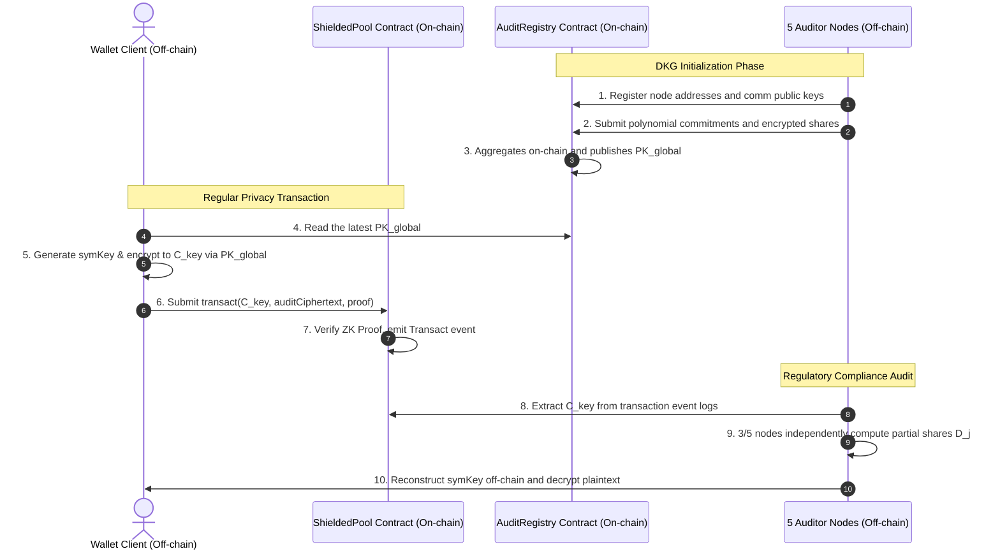

# Implementation Plan - 3/5 Threshold Asymmetric Decryption & DKG

This plan outlines the design and implementation of the off-chain cryptographic suite and the on-chain registry for the Advanced Audit & Traceability system in `privacy-erc20`. It introduces a 3-of-5 Threshold Elliptic Curve ElGamal encryption scheme over the BN254 curve, compatible with the `ark-bn254` library, and a decentralized auditor registry contract.

---

## Overall Architecture & Flow

The system achieves a closed loop through an on-chain/off-chain hybrid design: "On-chain anti-counterfeit proof verification & DKG bulletin board, off-chain threshold decryption."



---

## Technical Design & Cryptographic Specification

We use **Threshold Elliptic Curve ElGamal** over the $G_1$ subgroup of the **BN254** pairing-friendly elliptic curve.

### 1. 3-of-5 Distributed Key Generation (DKG)
Let $G \in G_1$ be the generator of the BN254 $G_1$ group. There are 5 nodes ($i \in \{1, 2, 3, 4, 5\}$). A threshold of $t = 3$ is required.

1. **Local Polynomial Selection**:
   Each node $i$ chooses a private random polynomial $f_i(x) \in Fr[x]$ of degree $t-1 = 2$:
   $$f_i(x) = a_{i,0} + a_{i,1}x + a_{i,2}x^2$$
   where $a_{i,j} \in Fr$ are randomly selected. The secret value of node $i$ is $s_i = a_{i,0} = f_i(0)$.

2. **Share Distribution**:
   Each node $i$ securely sends the share $s_{i,j} = f_i(j) \in Fr$ to node $j$ for each $j \in \{1, 2, 3, 4, 5\}$, encrypted under node $j$'s communication public key, and publishes it on the `AuditRegistry` contract.

3. **Key Share Aggregation**:
   Each node $j$ downloads its encrypted shares from the contract, decrypts them, and aggregates them:
   $$sk_j = \sum_{i=1}^{5} s_{i,j} = \sum_{i=1}^{5} f_i(j) \in Fr$$

4. **Public Key Aggregation**:
   Each node $i$ publicizes $A_{i,0} = a_{i,0} \cdot G \in G_1$.
   The **global audit public key** is computed by all nodes as:
   $$PK_{global} = \sum_{i=1}^{5} A_{i,0} = \left(\sum_{i=1}^{5} a_{i,0}\right) \cdot G = S_{global} \cdot G$$
   where $S_{global} = \sum_{i=1}^{5} a_{i,0}$ is the virtual (and never assembled) global private key.

### 2. Encryption (User/Wallet Side)
To encrypt the symmetric key `symKey` (represented as scalar $m \in Fr$):
1. Read the global public key $PK_{global}$ from `AuditRegistry`.
2. Sample a random ephemeral scalar $r \in Fr$.
3. Compute the ephemeral public key point $R \in G_1$:
   $$R = r \cdot G$$
4. Compute the shared secret point $S \in G_1$:
   $$S = r \cdot PK_{global}$$
5. Derive a blinding scalar $K_{deriv} \in Fr$ from the shared secret $S$. For BN254, we can hash the serialized $x$-coordinate of $S$:
   $$K_{deriv} = \text{Hash}(S_x) \pmod{Fr}$$
6. Encrypt the secret $m$:
   $$C_m = m + K_{deriv} \pmod{Fr}$$
7. The resulting ciphertext $C_{key}$ is the pair $(R, C_m)$. This is serialized to bytes and submitted as `encryptedAuditData`.

### 3. Threshold Decryption (Auditor Side)
Given a ciphertext $(R, C_m)$ and a subset $U \subseteq \{1, 2, 3, 4, 5\}$ of $|U| \ge 3$ nodes:
1. **Decryption Share Generation**:
   Each participating node $j \in U$ computes its partial decryption share $D_j \in G_1$:
   $$D_j = sk_j \cdot R$$
2. **Lagrange Interpolation**:
   The coordinator receives $D_j$ for $j \in U$. They compute the Lagrange coefficients $\lambda_j$ for $x = 0$ over the set $U$:
   $$\lambda_j = \prod_{k \in U,\ k \neq j} \frac{k}{k - j} \pmod{Fr}$$
   They reconstruct the shared secret $S$:
   $$S = \sum_{j \in U} \lambda_j \cdot D_j$$
3. **Decryption**:
   Derive $K_{deriv} = \text{Hash}(S_x) \pmod{Fr}$ and compute:
   $$m = C_m - K_{deriv} \pmod{Fr}$$

---

## Proposed Changes

### 1. On-Chain Smart Contracts

#### [NEW] [AuditRegistry.sol](file:///\\wsl$\Ubuntu\home\zaq1\eth\lambdaworks\privacy-erc20\contracts\src\AuditRegistry.sol)
Create a smart contract for managing auditor list and storing DKG data.

```solidity
// SPDX-License-Identifier: Apache-2.0
pragma solidity ^0.8.20;

/**
 * @title AuditRegistry
 * @notice Auditor list and DKG bulletin board contract.
 */
contract AuditRegistry {
    address[5] public auditors;
    mapping(address => bool) public isAuditor;

    mapping(address => bytes) public communicationPublicKeys;
    mapping(address => bytes[3]) public dkgCommitments;
    mapping(address => mapping(address => bytes)) public encryptedShares;

    bytes public globalAuditPublicKey;
    bool public isDkgCompleted;

    address public owner;

    event AuditorRegistered(address indexed auditor, bytes commPublicKey);
    event DkgCommitmentSubmitted(address indexed auditor, bytes[3] commitments);
    event DkgShareSubmitted(address indexed sender, address indexed recipient, bytes encryptedShare);
    event DkgCompleted(bytes globalPublicKey);

    modifier onlyAuditor() {
        require(isAuditor[msg.sender], "Not an authorized auditor");
        _;
    }

    constructor(address[5] memory _auditors) {
        auditors = _auditors;
        for (uint i = 0; i < 5; i++) {
            isAuditor[_auditors[i]] = true;
        }
        owner = msg.sender;
    }

    function registerCommunicationKey(bytes calldata pubKey) external onlyAuditor {
        communicationPublicKeys[msg.sender] = pubKey;
        emit AuditorRegistered(msg.sender, pubKey);
    }

    function submitDkgData(
        bytes[3] calldata commitments,
        address[5] calldata recipients,
        bytes[5] calldata shares
    ) external onlyAuditor {
        dkgCommitments[msg.sender] = commitments;
        emit DkgCommitmentSubmitted(msg.sender, commitments);

        for (uint i = 0; i < 5; i++) {
            if (recipients[i] != address(0) && shares[i].length > 0) {
                encryptedShares[msg.sender][recipients[i]] = shares[i];
                emit DkgShareSubmitted(msg.sender, recipients[i], shares[i]);
            }
        }
    }

    function finalizeGlobalPublicKey(bytes calldata globalPubKey) external {
        require(msg.sender == owner || isAuditor[msg.sender], "Unauthorized");
        globalAuditPublicKey = globalPubKey;
        isDkgCompleted = true;
        emit DkgCompleted(globalPubKey);
    }
}
```

---

### 2. Off-Chain Client Library (Rust)

#### [NEW] [audit.rs](file:///\\wsl$\Ubuntu\home\zaq1\eth\lambdaworks\privacy-erc20\client\src\audit.rs)
We will create a module `audit` that implements the above threshold cryptographic scheme.

Key structural definitions:
```rust
use ark_bn254::{Fr, G1Projective};
use serde::{Serialize, Deserialize};

pub struct DkgPolynomial {
    pub node_id: usize,
    pub coefficients: Vec<Fr>,
}

#[derive(Clone, Serialize, Deserialize)]
pub struct PrivateKeyShare {
    pub node_id: usize,
    pub share: Fr,
}

#[derive(Clone, Serialize, Deserialize)]
pub struct AuditPublicKey {
    pub point: G1Projective,
}

#[derive(Clone, Serialize, Deserialize)]
pub struct EncryptedAuditKey {
    pub ephemeral_public: G1Projective,
    pub masked_key: Fr,
}

#[derive(Clone, Serialize, Deserialize)]
pub struct DecryptionShare {
    pub node_id: usize,
    pub share_point: G1Projective,
}
```

Key operations implemented:
- `DkgPolynomial::new(node_id: usize, threshold: usize) -> Self`
- `DkgPolynomial::evaluate(&self, x: usize) -> Fr`
- `PrivateKeyShare::aggregate(shares: &[Fr], node_id: usize) -> Self`
- `AuditPublicKey::aggregate(nodes_public_commitments: &[G1Projective]) -> Self`
- `EncryptedAuditKey::encrypt(pub_key: &AuditPublicKey, sym_key: Fr) -> Self`
- `EncryptedAuditKey::decrypt_share(&self, priv_share: &PrivateKeyShare) -> DecryptionShare`
- `EncryptedAuditKey::decrypt(&self, shares: &[DecryptionShare]) -> Result<Fr, &'static str>`

#### [MODIFY] [lib.rs](file:///\\wsl$\Ubuntu\home\zaq1\eth\lambdaworks\privacy-erc20\client\src\lib.rs)
Expose the new audit module:
```rust
pub mod wallet;
pub mod audit;
```

---

## Verification Plan

### Automated Tests
1. **Integration tests**: Verify DKG generation, encryption, and threshold decryption under various 3/5 auditor subset configurations.
2. **Contract tests**: Write `AuditRegistry.t.sol` using Foundry to verify the on-chain registry flow.

### Manual Verification
- Run `forge test` and `cargo test -p privacy-erc20-client`.
