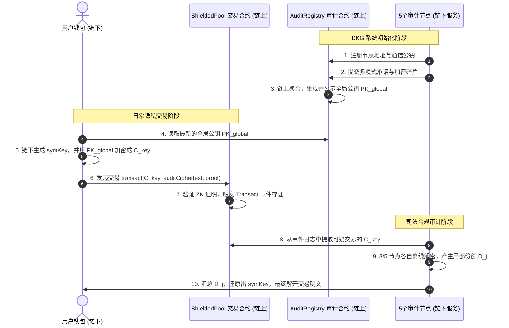

# 实施计划 - 3/5 门限非对称解密与 DKG（分布式密钥生成）

本计划概述了 `privacy-erc20` 协议中高级审计与追溯系统（Advanced Audit & Traceability）的链上与链下完整闭环架构设计。我们将在 **BN254** 椭圆曲线上实现一套 3/5 门限椭圆曲线 ElGamal（Threshold Elliptic Curve ElGamal）加密方案，并新增链上审计注册管理合约，建立去中心化的 DKG（分布式密钥生成）公告板机制。

---

## 整体架构与分工

整个审计与追溯系统由**链上智能合约**与**链下客户端/审计服务**共同构成，实现“链上防伪存证、链上 DKG 协调、链下门限解密”的完整闭环。



---

## 链下技术设计与密码学规范

我们采用 **BN254 椭圆曲线 $G_1$ 子群** 上的 **门限椭圆曲线 ElGamal 加密算法**。

### 1. 3-of-5 分布式密钥生成 (DKG)
令 $G \in G_1$ 为 BN254 $G_1$ 群的生成元。系统中有 5 个节点（$i \in \{1, 2, 3, 4, 5\}$），门限要求为 $t = 3$。

1. **本地多项式选择**：
   每个节点 $i$ 在本地随机选择一个 $t-1 = 2$ 次的秘密多项式 $f_i(x) \in Fr[x]$：
   $$f_i(x) = a_{i,0} + a_{i,1}x + a_{i,2}x^2$$
   其中 $a_{i,j} \in Fr$ 为随机选择的域元素。节点 $i$ 的本地秘密值为 $s_i = a_{i,0} = f_i(0)$。

2. **碎片分发**：
   每个节点 $i$ 计算碎片值 $s_{i,j} = f_i(j) \in Fr$（对于 $j \in \{1, 2, 3, 4, 5\}$）。使用节点 $j$ 的通信公钥将其加密，并上传至链上合约 `AuditRegistry`。

3. **密钥碎片聚合**：
   每个节点 $j$ 通过链上下载属于自己的加密碎片并解密，然后求和计算出其最终的长期的私钥碎片 $sk_j$：
   $$sk_j = \sum_{i=1}^{5} s_{i,j} = \sum_{i=1}^{5} f_i(j) \in Fr$$

4. **公钥聚合**：
   每个节点 $i$ 公开其本地秘密承诺点 $A_{i,0} = a_{i,0} \cdot G \in G_1$。
   所有节点或智能合约共同计算出**全局审计公钥**：
   $$PK_{global} = \sum_{i=1}^{5} A_{i,0} = \left(\sum_{i=1}^{5} a_{i,0}\right) \cdot G = S_{global} \cdot G$$
   这里 $S_{global} = \sum_{i=1}^{5} a_{i,0}$ 是虚拟的、自始至终从未在任何地方完整拼装过的“全局秘密私钥”。

### 2. 加密（用户/钱包侧）
为了加密对称密钥 `symKey`（表示为标量 $m \in Fr$）：
1. 从 `AuditRegistry` 合约读取全局公钥 $PK_{global}$。
2. 采样一个随机临时标量 $r \in Fr$，计算临时公钥点 $R \in G_1$：
   $$R = r \cdot G$$
3. 计算共享秘密点 $S \in G_1$：
   $$S = r \cdot PK_{global}$$
4. 从共享秘密 $S$ 的 $x$ 坐标中派生出致盲标量 $K_{deriv} \in Fr$：
   $$K_{deriv} = \text{Hash}(S_x) \pmod{Fr}$$
5. 加密明文秘密 $m$：
   $$C_m = m + K_{deriv} \pmod{Fr}$$
6. 最终的密文 $C_{key}$ 即为点对 $(R, C_m)$。钱包将其序列化为字节流，并作为 `encryptedAuditData` 提交给智能合约。

### 3. 门限解密（审计端）
给定密文 $(R, C_m)$ 和参与解密的节点子集 $U \subseteq \{1, 2, 3, 4, 5\}$（其中 $|U| \ge 3$）：
1. **生成解密份额**：
   每个参与解密的节点 $j \in U$ 使用自己的私钥碎片 $sk_j$ 计算出局部解密份额点 $D_j \in G_1$：
   $$D_j = sk_j \cdot R$$
2. **拉格朗日插值重组**：
   协调人收集到所有 $D_j$（对于 $j \in U$）。在有限域 $Fr$ 内计算 $x = 0$ 处对应点集 $U$ 的拉格朗日插值系数 $\lambda_j$：
   $$\lambda_j = \prod_{k \in U,\ k \neq j} \frac{k}{k - j} \pmod{Fr}$$
   使用这些系数加权求和还原出共享秘密 $S$：
   $$S = \sum_{j \in U} \lambda_j \cdot D_j$$
3. **解密还原**：
   采用相同方式派生 $K_{deriv} = \text{Hash}(S_x) \pmod{Fr}$，最终还原出明文对称密钥：
   $$m = C_m - K_{deriv} \pmod{Fr}$$

---

## 拟做的代码修改

### 1. 链上智能合约

#### [NEW] [AuditRegistry.sol](file:///\\wsl$\Ubuntu\home\zaq1\eth\lambdaworks\privacy-erc20\contracts\src\AuditRegistry.sol)
在 `contracts/src` 中新建审计管理与 DKG 存证公告板合约。

```solidity
// SPDX-License-Identifier: Apache-2.0
pragma solidity ^0.8.20;

/**
 * @title AuditRegistry
 * @notice 审计节点名录与 DKG 公告板智能合约
 */
contract AuditRegistry {
    // 5个审计节点的以太坊地址列表
    address[5] public auditors;
    mapping(address => bool) public isAuditor;

    // 节点的通信公钥 (用于加密传输 DKG 多项式评估碎片)
    mapping(address => bytes) public communicationPublicKeys;

    // 节点的 DKG 多项式承诺列表 (A_i,0, A_i,1, A_i,2)
    mapping(address => bytes[3]) public dkgCommitments;

    // DKG 节点加密碎片存储: 发送方 -> 接收方 -> 加密后的评估值
    mapping(address => mapping(address => bytes)) public encryptedShares;

    // 聚合完成后的全局审计公钥 (序列化后的 G1 点)
    bytes public globalAuditPublicKey;
    bool public isDkgCompleted;

    address public owner;

    event AuditorRegistered(address indexed auditor, bytes commPublicKey);
    event DkgCommitmentSubmitted(address indexed auditor, bytes[3] commitments);
    event DkgShareSubmitted(address indexed sender, address indexed recipient, bytes encryptedShare);
    event DkgCompleted(bytes globalPublicKey);

    modifier onlyAuditor() {
        require(isAuditor[msg.sender], "Not an authorized auditor");
        _;
    }

    constructor(address[5] memory _auditors) {
        auditors = _auditors;
        for (uint i = 0; i < 5; i++) {
            isAuditor[_auditors[i]] = true;
        }
        owner = msg.sender;
    }

    // 节点注册通信公钥
    function registerCommunicationKey(bytes calldata pubKey) external onlyAuditor {
        communicationPublicKeys[msg.sender] = pubKey;
        emit AuditorRegistered(msg.sender, pubKey);
    }

    // 提交 DKG 多项式承诺与加密碎片
    function submitDkgData(
        bytes[3] calldata commitments,
        address[5] calldata recipients,
        bytes[5] calldata shares
    ) external onlyAuditor {
        dkgCommitments[msg.sender] = commitments;
        emit DkgCommitmentSubmitted(msg.sender, commitments);

        for (uint i = 0; i < 5; i++) {
            if (recipients[i] != address(0) && shares[i].length > 0) {
                encryptedShares[msg.sender][recipients[i]] = shares[i];
                emit DkgShareSubmitted(msg.sender, recipients[i], shares[i]);
            }
        }
    }

    // 设定/公示最终生成的全局审计公钥
    function finalizeGlobalPublicKey(bytes calldata globalPubKey) external {
        // 在实际生产中，该函数可通过合约内部的椭圆曲线点聚合验证后自动调用
        // 这里提供基础设置接口以供演示与流程联调
        require(msg.sender == owner || isAuditor[msg.sender], "Unauthorized");
        globalAuditPublicKey = globalPubKey;
        isDkgCompleted = true;
        emit DkgCompleted(globalPubKey);
    }
}
```

---

### 2. 链下客户端（Rust）

#### [NEW] [audit.rs](file:///\\wsl$\Ubuntu\home\zaq1\eth\lambdaworks\privacy-erc20\client\src\audit.rs)
创建新模块 `audit`，实现门限密码学算法。

核心数据结构定义：
```rust
use ark_bn254::{Fr, G1Projective};
use serde::{Serialize, Deserialize};

/// DKG 中节点的本地秘密多项式
pub struct DkgPolynomial {
    pub node_id: usize,
    pub coefficients: Vec<Fr>,
}

/// 节点的私钥碎片
#[derive(Clone, Serialize, Deserialize)]
pub struct PrivateKeyShare {
    pub node_id: usize,
    pub share: Fr,
}

/// 全局审计公钥
#[derive(Clone, Serialize, Deserialize)]
pub struct AuditPublicKey {
    pub point: G1Projective,
}

/// 被加密的审计对称密钥密文 (C_key)
#[derive(Clone, Serialize, Deserialize)]
pub struct EncryptedAuditKey {
    pub ephemeral_public: G1Projective,
    pub masked_key: Fr,
}

/// 单个节点生成的局部解密份额
#[derive(Clone, Serialize, Deserialize)]
pub struct DecryptionShare {
    pub node_id: usize,
    pub share_point: G1Projective,
}
```

实现的关键操作：
- `DkgPolynomial::new(node_id: usize, threshold: usize) -> Self`
- `DkgPolynomial::evaluate(&self, x: usize) -> Fr`
- `PrivateKeyShare::aggregate(shares: &[Fr], node_id: usize) -> Self`
- `AuditPublicKey::aggregate(nodes_public_commitments: &[G1Projective]) -> Self`
- `EncryptedAuditKey::encrypt(pub_key: &AuditPublicKey, sym_key: Fr) -> Self`
- `EncryptedAuditKey::decrypt_share(&self, priv_share: &PrivateKeyShare) -> DecryptionShare`
- `EncryptedAuditKey::decrypt(&self, shares: &[DecryptionShare]) -> Result<Fr, &'static str>`

#### [MODIFY] [lib.rs](file:///\\wsl$\Ubuntu\home\zaq1\eth\lambdaworks\privacy-erc20\client\src\lib.rs)
导出新的审计模块：
```rust
pub mod wallet;
pub mod audit;
```

---

## 验证与测试计划

### 自动化测试
1. **DKG 与加密集成测试**：验证在 DKG 产生公钥和私钥碎片后，任何 3 个节点的组合解密均能完美还原对称密钥，而任意 2 个节点的解密组合必然失败。
2. **链上合约测试 (Foundry)**：编写 `AuditRegistry.t.sol` 测试合约，验证 5 个节点注册通信公钥、发布承诺与加密碎片、以及最终确定全局公钥的流程。

### 手动验证
- 运行 `forge test` 验证智能合约所有流程。
- 运行 `cargo test -p privacy-erc20-client` 验证密码学算法的正确性。
